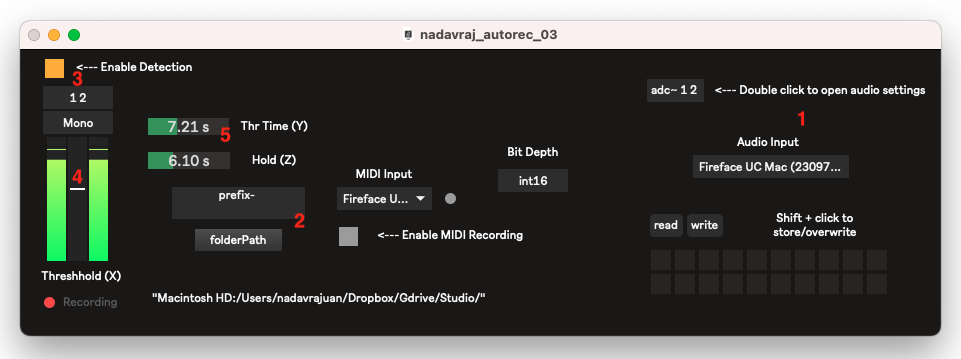

# AlwaysON
a MAX/MSP listener patch from the sound card input sources which start recording automatically whenever a db threshold is being reached

#  Table of Contents

- [Download](#Download)
- [How to use](#How to use)
- [Features](#Features)

# Download

## Mac OS Download

The latest stable release is available via the url below:
[https://www.dropbox.com/s/m028zud6bye5sy8/AlwaysON.zip?dl=0](https://www.dropbox.com/s/viy25928elhggw5/nadavraj_autorec_03.zip?dl=0)

# How to use

1. Click on “Audio Input” to choose the input channel. This will make the listener activated
2. Choose the export path (folderpath) and filename prefix - this is where your recording will be named and saved.
3. Click “Enable Detection” to enable auto-recording
4. Drag the fader to change the Threshold (X). 
5. Set your Y (Thr Time) and Z (Hold) Parameters

## The Parameters
There are 3 main parameters you can set:
1. Threshold (X)
2. Threshold Time (Y)
3. Hold (Z)

The recording will only start if X (Threshold) is being reached for more than Y (Thr Time) seconds. 
If X (Threshold) is below Y (Thr Time)  for less than Z (Hold) time - it will still continue to record.

# Features
- Supports recording of audio and midi
- Recording will start automatically only if threshold (which can be determined) will be above X db for Y seconds. 
- Recording will continue as long as threshold is still above X, but with a time-window of Z secs- where even if the threshold is below X, it will continue (so it won’t just stop immediately on each pause)
- Once recording is completed (meaning threshold X has not reached for Z seconds) - the recording will be saved as a file
- The File is named automatically with date and time, and a prefix which can be modified
- The app will continue listening to the audio input for the next recording.
- You can set a few different input sources from the sound card, for each listener (mono or stereo) and define different values of X,Y,Z values.

